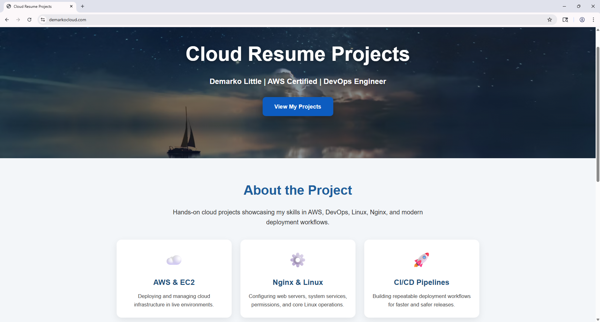
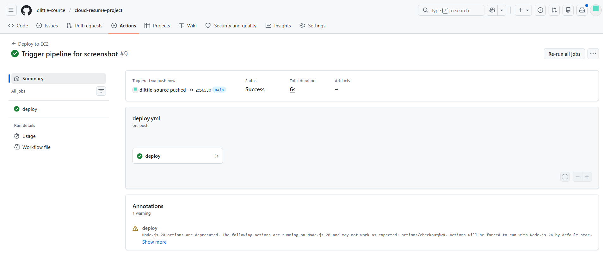
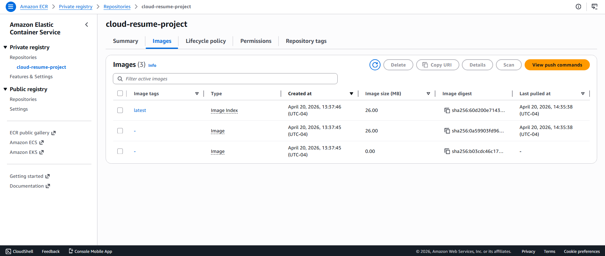
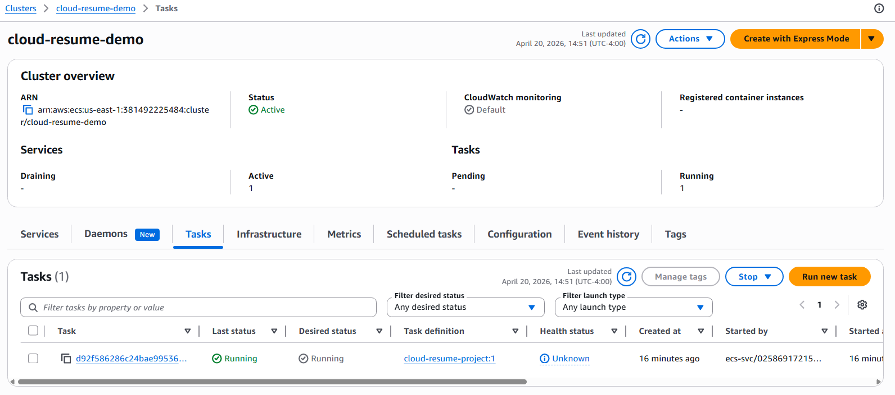
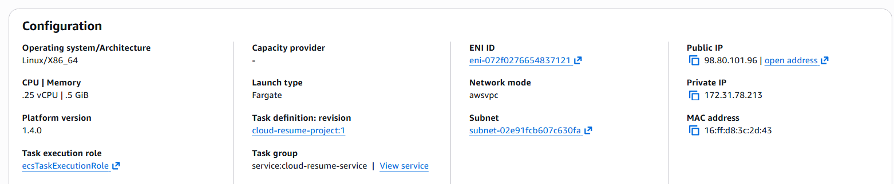

# Cloud Resume Project (DevOps + AWS + CI/CD + Containers)

A production-style cloud deployment project demonstrating real-world DevOps practices across infrastructure, CI/CD automation, and containerized cloud deployments.

- EC2 + Nginx + HTTPS deployment
- CI/CD automation with GitHub Actions (self-hosted runner)
- Containerization with Docker
- AWS ECR + ECS Fargate deployment (on-demand demo)

## Architecture

This project demonstrates three deployment patterns:

### 1. Traditional Deployment (Live)
GitHub → EC2 → Nginx → HTTPS (Certbot)

### 2. CI/CD Automation
GitHub Actions → Self-hosted Runner (EC2) → rsync → Nginx

### 3. Containerized Deployment (Demo)
Docker → Amazon ECR → ECS Fargate → Public IP

## Key Features

- Deployed a secure web application on AWS EC2 using Nginx and SSL (Certbot)
- Built a CI/CD pipeline using GitHub Actions with a self-hosted runner
- Automated deployments using rsync and Git-based workflows
- Containerized the application using Docker
- Pushed container images to Amazon ECR
- Deployed containers using AWS ECS Fargate (serverless containers)
- Implemented security best practices (SSH hardening, key-based access)
- Designed cost-efficient deployment strategy (on-demand ECS demo)

## Tech Stack

- AWS EC2
- AWS ECS (Fargate)
- AWS ECR
- Nginx
- GitHub Actions
- Docker
- Linux (Ubuntu)
- SSH / Networking / Security Groups

## CI/CD Pipeline

1. Code is pushed to GitHub
2. GitHub Actions workflow is triggered
3. Self-hosted runner executes on EC2
4. Latest changes are pulled from repository
5. Files are synchronized to `/var/www/html` using rsync
6. Nginx is reloaded to apply updates

For container deployment:
- Docker image is built locally
- Image is pushed to Amazon ECR
- ECS service is created for on-demand deployment

## Security

- Disabled password-based SSH authentication
- Disabled root login
- Restricted SSH access to a single IP
- Used key-based authentication
- Scoped sudo permissions for deployment automation

## Screenshots

### 🌐 EC2 + Nginx (HTTPS)

- Application deployed on AWS EC2
- Served using Nginx and secured with HTTPS (Certbot)

---

### ⚙️ CI/CD Pipeline (GitHub Actions)

- Automated deployment triggered on push to `main`
- Uses a self-hosted runner on EC2
- Syncs files using `rsync` and reloads Nginx

---

### 📦 Amazon ECR (Docker Image)

- Docker image stored in Amazon ECR
- Used as the deployment artifact for ECS

---

### 🚀 ECS Fargate Deployment

- Container deployed using AWS ECS Fargate
- Running task with `awsvpc` networking and public IP
- Demonstrates serverless container deployment

---

### 🌐 Application via ECS Public IP

- Application accessible via ECS task public IP
- Confirms successful container deployment

## Lessons Learned

- Difference between push-based and pull-based deployments
- Trade-offs between EC2 and Fargate (cost vs scalability)
- Importance of security hardening (SSH, IAM, network access)
- Managing CI/CD pipelines across multiple deployment strategies
- Handling real-world debugging (SSH, permissions, networking)

## Future Improvements

- Implement full CI/CD pipeline for container deployment (GitHub Actions → ECR → ECS using OIDC)
- Add monitoring and logging with Amazon CloudWatch
- Manage infrastructure using Terraform (Infrastructure as Code)
- Introduce blue/green deployment strategy for zero-downtime releases

